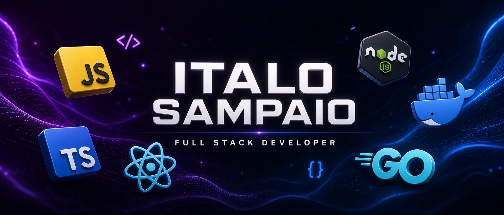

  

  <h1> Hi, I'm Italo Sampaio! </h1>
  <h3><b>Full Stack Developer |</b> ADS Graduate • Post-graduate in Software Engineering & DevOps</h3>

###

<h3 align="left">🛠 Languages and Tools</h3>

###

  <table>
    <tr>
      <td align="center"><b>Frontend</b> </td>
      <td align="center"><b>Backend</b> </td>
    </tr>
    <tr>
      <td align="center"><b>Databases</b> </td>
      <td align="center"><b>DevOps & Tools</b> </td>
    </tr>
  </table>

### 👾 My GitHub Contribution Pacman
<picture>
  <source media="(prefers-color-scheme: dark)" srcset="https://raw.githubusercontent.com/italo12346/italo12346/output/pacman-contribution-graph.svg">
  <source media="(prefers-color-scheme: light)" srcset="https://raw.githubusercontent.com/italo12346/italo12346/output/pacman-contribution-graph.svg">
  
</picture>

---

### 🚀 Projects I'm proud to have built

- **[Barba-Corte](https://github.com/italo12346/Barba-Corte)** 💈✂️
  - Barba-Corte was born from the need to organize the daily routine of barbershops. It's a practical system focused on agility and efficiency.
  - **[Techs]**: JavaScript

- **[gerenciador-de-estagio](https://github.com/italo12346/gerenciador-de-estagio)** 🎓💼
  - I developed this project during my DAC course. it helps manage the flow of internships in a simple and effective way.
  - **[Techs]**: Java

- **[Catalogo-de-Filmes-Dockerizado](https://github.com/italo12346/Catalogo-de-Filmes-Dockerizado)** 🎬🐳
  - Here I dove deep into microservices and Docker. It's a complete movie catalog system, scalable and ready for deployment.
  - **[Techs]**: TypeScript, Node.js, Next.js, Docker

- **[RagDev](https://github.com/italo12346/RagDev)** 💻📱
  - RagDev is a social network designed for us, developers. A place to share code, questions, and knowledge.
  - **[Techs]**: TypeScript

---

  

        <h3>🧑‍💻 A bit about me</h3>
        

          I've been passionate about technology since I was young. I graduated in Analysis and Systems Development from IFPB and I'm now deepening my knowledge in Software Engineering and DevOps at UNIFOR.
        

        

          My journey started in systems maintenance, but I soon discovered that my place was building solutions. I've worked in a junior company, as a freelancer, and today I strive to evolve further in systems architecture and DevOps culture.
        

        <h3>🌎 Let's connect!</h3>
        

            
            
            
        

  

  

        <h3>📊 My Stats</h3>bottom: 10px;">
        
        
  

---

  ⭐ Thanks for stopping by! If you like any project, <b>leave a star</b> 🌟 and let's connect!

